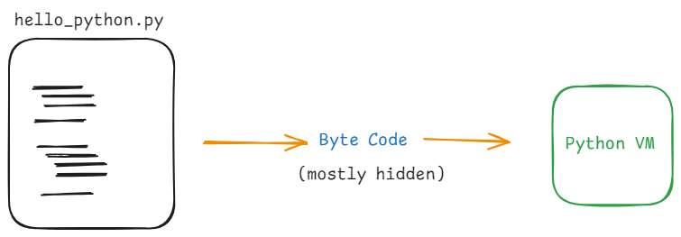
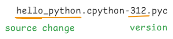

# Python innner working

- Python code is compiled to Byte code (low level code & Platform independent)

- Byte Code runs faster 
  .pyc -> compiled python (frozen binaries)

  __ pycache__

  
   - Works only for imported files
   - not generated for main file

***

### Python Virtual Machine
- Run Time Engine
- Also known as `Python Interpreter`.

### Byte Code is not Machine Code
- Python specific interpretation
- Cpython (standard python), jython, Iron Python, Stackless,Pypy
